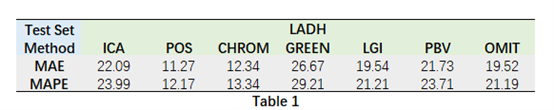
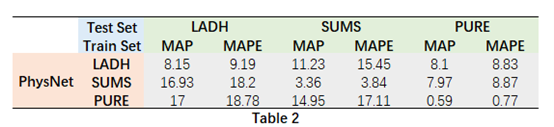

# Setup

STEP1: `bash setup.sh` 

STEP2: `conda activate rppg-toolbox` 

STEP3: `pip install -r requirements.txt` 

# Example of neural network training

Please use config files under `./configs/train_configs/LADH_PHYSNET_*`

## Train on LADH, valid on LADH and test on LADH with FusionPhysNet 

STEP1: Download the LADH raw data by asking the [paper authors]().

STEP2: Modify `./configs/train_configs/LADH_PHYSNET_face_RGB_IR_both.yaml` 

STEP4: Run `python main.py --config_file ./configs/train_configs/LADH_PHYSNET_face_RGB_IR_both.yaml --r_lr 9e-3 --epochs 30 --path res_30_9e-3/face_RGB_IR_both` 

Note1: Preprocessing requires only once; thus turn it off on the yaml file when you train the network after the first time. 

Note2: The example yaml setting will allow 70% of LADH(state 1, 2, 3, 4, 5) to train, 20% of LADH to valid and 20% of LADH to test. After training, it will use the best model(with the least validation loss) to test on LADH.（This is the day-wise partitioning experiment）

Note3: You can set the learning rate, epochs and save path

# Yaml File Setting
The rPPG-Toolbox uses yaml file to control all parameters for training and evaluation. 
You can modify the existing yaml files to meet your own training and testing requirements.

Here are some explanation of parameters:
* #### TOOLBOX_MODE: 
  * `train_and_test`: train on the dataset and use the newly trained model to test.
  * `only_test`: you need to set INFERENCE-MODEL_PATH, and it will use pre-trained model initialized with the MODEL_PATH to test.
* #### TASK:
  * `bvp`: only bvp => hr.
  * `spo2`: only spo2.
  * `rr`: only rr.
  * `both`: bvp => hr and spo2 and rr.
* #### DATASET_TYPE:
  * `face`: only RGB video.
  * `face_IR`: only IR video.
  * `both`:  RGB and IR video.
* #### TRAIN / VALID / TEST: 
  * `DATA.INFO.STATE`: Filter the dataset by 5 states, like [1, 2, 3, 4, 5]
  * `DATA.INFO.TYPE`: 1 stands for face, 2 stands for face_IR. like [1, 2]
  * `DATA.DATASET_TYPE`: face,  face_IR or both, the type of dataset
  * `DATA_PATH`: The input path of raw data
  * `CACHED_PATH`: The output path to preprocessed data. This path also houses a directory of .csv files containing data paths to files loaded by the dataloader. This filelist (found in default at CACHED_PATH/DataFileLists). These can be viewed for users to understand which files are used in each data split (train/val/test)

  * `EXP_DATA_NAME` If it is "", the toolbox generates a EXP_DATA_NAME based on other defined parameters. Otherwise, it uses the user-defined EXP_DATA_NAME.  
  * `BEGIN" & "END`: The portion of the dataset used for training/validation/testing. For example, if the `DATASET` is PURE, `BEGIN` is 0.0 and `END` is 0.8 under the TRAIN, the first 80% PURE is used for training the network. If the `DATASET` is PURE, `BEGIN` is 0.8 and `END` is 1.0 under the VALID, the last 20% PURE is used as the validation set. It is worth noting that validation and training sets don't have overlapping subjects.  
  * `DATA_TYPE`: How to preprocess the video data
  * `LABEL_TYPE`: How to preprocess the label data
  * `DO_CHUNK`: Whether to split the raw data into smaller chunks
  * `CHUNK_LENGTH`: The length of each chunk (number of frames)
  * `CROP_FACE`: Whether to perform face detection
  * `DYNAMIC_DETECTION`: If False, face detection is only performed at the first frame and the detected box is used to crop the video for all of the subsequent frames. If True, face detection is performed at a specific frequency which is defined by `DYNAMIC_DETECTION_FREQUENCY`. 
  * `DYNAMIC_DETECTION_FREQUENCY`: The frequency of face detection (number of frames) if DYNAMIC_DETECTION is True
  * `LARGE_FACE_BOX`: Whether to enlarge the rectangle of the detected face region in case the detected box is not large enough for some special cases (e.g., motion videos)
  * `LARGE_BOX_COEF`: The coefficient of enlarging. See more details at `https://github.com/ubicomplab/rPPG-Toolbox/blob/main/dataset/data_loader/BaseLoader.py#L162-L165`. 

  
* #### MODEL : Set used model FusionPhysnet right now and their parameters.
* #### METRICS: Set used metrics. Example: ['MAE','RMSE','MAPE','Pearson']

# Dataset
The toolbox supports SUMS dataset, Cite corresponding papers when using.

* [LADH](https://github.com/McJackTang/FusionVitals)
    * In order to use this dataset in a deep model, you should organize the files as follows:
    
    -----------------
         data/LADH/
         |   |-- 12_05/
         |       |-- p_12_05_caip
         |           |-- v01
         |               |-- BVP.csv
         |               |-- HR.csv
         |               |-- RR.csv
         |               |-- SpO2.csv
         |               |-- frames_timestamp_IR.csv
         |               |-- frames_timestamp_RGB.csv
         |               |-- video_RGB_H264.avi
         |               |-- video_IR_H264.avi
         |           |-- v02
         |           |-- v03
         |           |-- v04
         |           |-- v05
         |       |-- p_12_05_huangxj
         |           |-- v01
         |               |-- ...
         |           |-- v02
         |           |-- v03
         |           |-- v04
         |           |-- v05
         |       |-- p_12_05_liutj
         |       |-- p_12_05_lujg
         |       |-- ...
         |   |-- 12_06/
         |       |-- p_12_06_caip
         |       |-- p_12_06_huangxj
         |       |-- p_12_06_liutj
         |       |-- p_12_06_lujg
         |       |...
         |   |-- ...
         |   
         |     
    -----------------

# Comparative Experiment
The table1 shows the Mean Absolute Error (MAE) and Mean Absolute Percent Error (MAPE) performance of the LADH dataset under unsupervised algorithms.
<table> 
    <tr>               
      <th>Test Set</th>
      <th colspan="7">LADH</th>
    </tr>
    <tr>      
      <th>Method</th> 
      <th>ICA</th>
      <th>POS</th>
      <th>CHROM</th>
      <th>GREEN</th>
      <th>LGI</th>
      <th>PBV</th>
      <th>OMIT</th>
      </tr>
     <tr>      
      <td>MAE</td> 
      <td>22.09</td>
      <td>11.27</td>
      <td>12.34</td>
      <td>26.67</td>
      <td>19.54</td>
      <td>21.73</td>
      <td>19.52</td>
     </tr>
     <tr>      
      <td>MAPE</td> 
      <td>23.99</td>
      <td>12.17</td>
      <td>13.34</td>
      <td>29.21</td>
      <td>21.21</td>
      <td>23.71</td>
      <td>21.19</td>
     </tr>
</table>

Table 2 shows the cross-dataset experimental results of the LADH, SUMS, and PURE datasets on the PhysNet model.

